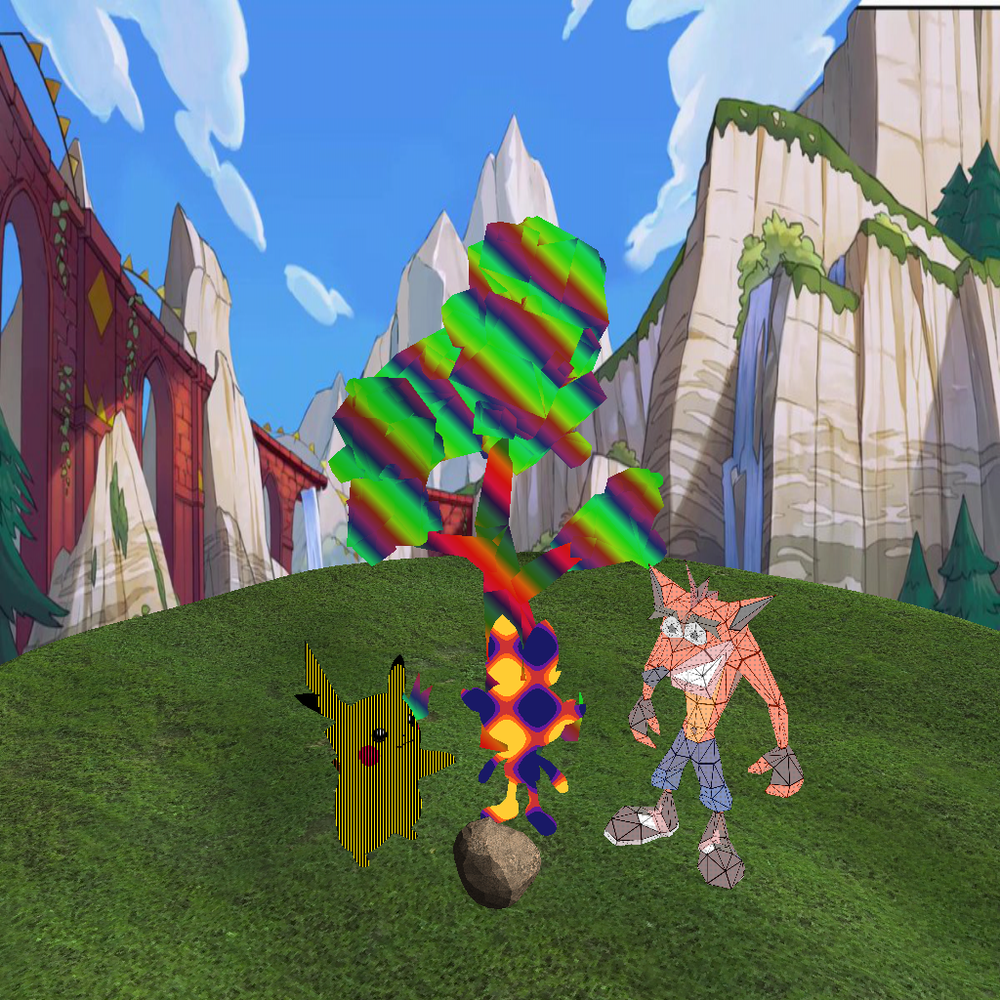
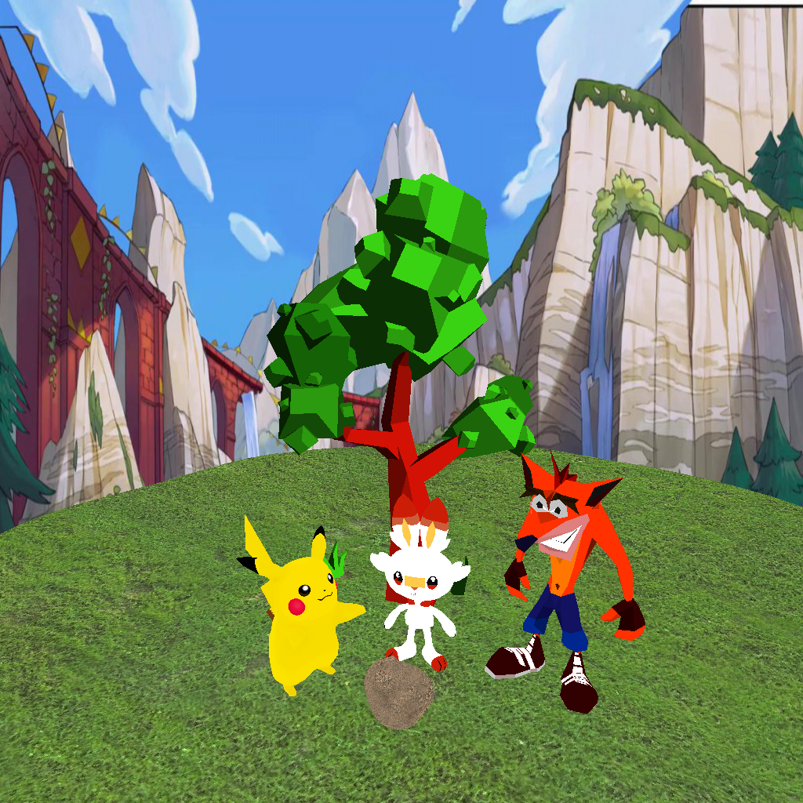

# Rasterization

## Lab 3
Para conseguir las 4 tomas en formato .bmp, debes ejecutar el archivo Fourshoots.py.

## Proyecto 1
<table>
  <tr>
    <td align="center">
      <strong>Con shaders</strong> 
      
    </td>
    <td align="center">
      <strong>Sin shaders</strong> 
      
    </td>
  </tr>
</table>
